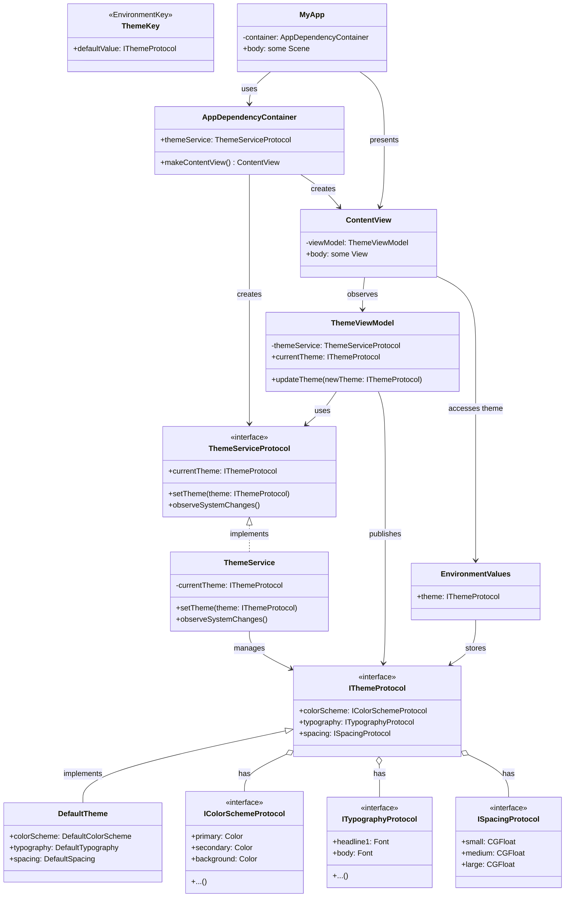

# 🎨 SwiftUI Theme Manager 🚀

Hey there, awesome developer! 👋 Welcome to the SwiftUI Theme Manager package. This cool little tool is gonna make theming your SwiftUI apps a breeze! 😎

## 🌟 Features

- 🔌 Plug and play - no setup required!
- 🔒 End-to-end type safety (because we all hate runtime crashes, right?)
- 🛠 Customizable existing themes
- 🎭 Create and use your own custom themes
- 🔄 Easy theme switching on the fly
- 👀 View all the colors in your theme
- 🎨 Set custom color schemes
- 📱 Default theme change/view UI included
- 🖌 Ability to create your own theme change/view UI
- 🍎 Follows Apple guidelines and best practices
- 📦 Available through Swift Package Manager

## 🗺 Roadmap

Here's what we're planning to work on:

- [ ] Implement core theme protocols
- [ ] Create default theme implementation
- [ ] Develop theme service for managing themes
- [ ] Build theme view model for MVVM architecture
- [ ] Design and implement SwiftUI views for theme preview and selection
- [ ] Create custom environment key for theme injection
- [ ] Write comprehensive unit tests
- [ ] Develop sample app showcasing theme manager features
- [ ] Create detailed documentation and usage guide
- [ ] Implement CI/CD pipeline for automated testing and deployment

## 🏗 Architecture

Here's a sneak peek at our awesome architecture:



Cool, right? 😎

## 📘 Usage Guide

Don't worry, using this theme manager is gonna be super easy! Here's a quick guide to get you started:

1. 📦 Install the package (we'll add detailed SPM instructions soon!)
2. 🏗 Set up your app's entry point:

```swift
@main
struct MyApp: App {
    let container = AppDependencyContainer()
    
    var body: some Scene {
        WindowGroup {
            container.makeContentView()
                .environmentObject(container.themeService)
        }
    }
}
```

3. 🎨 Use the theme in your views:

```swift
struct ContentView: View {
    @Environment(\.theme) var theme
    
    var body: some View {
        Text("Hello, World!")
            .foregroundColor(theme.colorScheme.primary)
            .font(theme.typography.body)
    }
}
```

4. 🔄 Change themes on the fly:

```swift
struct ThemeSwitcherView: View {
    @EnvironmentObject var themeService: ThemeService
    
    var body: some View {
        Button("Switch Theme") {
            themeService.setTheme(AlternateTheme())
        }
    }
}
```

And that's it! You're now a theming wizard! 🧙‍♂️✨

## 📁 Project Structure

Here's how we've organized our project:

```
SwiftUIThemeManager/
├── Package.swift
├── README.md
├── LICENSE.md
├── Sources/
│   └── SwiftUIThemeManager/
│       ├── Core/
│       │   ├── Protocols/
│       │   │   ├── IThemeProtocol.swift
│       │   │   ├── IColorSchemeProtocol.swift
│       │   │   ├── ITypographyProtocol.swift
│       │   │   └── ISpacingProtocol.swift
│       │   ├── Models/
│       │   │   ├── DefaultTheme.swift
│       │   │   ├── DefaultColorScheme.swift
│       │   │   ├── DefaultTypography.swift
│       │   │   └── DefaultSpacing.swift
│       │   └── Enums/
│       │       ├── ColorKey.swift
│       │       ├── TypographyKey.swift
│       │       └── SpacingKey.swift
│       ├── Services/
│       │   ├── ThemeServiceProtocol.swift
│       │   └── ThemeService.swift
│       ├── ViewModels/
│       │   └── ThemeViewModel.swift
│       ├── Views/
│       │   ├── ThemePreviewView.swift
│       │   └── ThemeSwitcherView.swift
│       ├── Environment/
│       │   └── ThemeEnvironment.swift
│       └── Utils/
│           └── ThemeModifier.swift
├── Tests/
│   └── SwiftUIThemeManagerTests/
│       ├── CoreTests/
│       │   ├── DefaultThemeTests.swift
│       │   └── ...
│       ├── ServiceTests/
│       │   └── ThemeServiceTests.swift
│       └── ViewModelTests/
│           └── ThemeViewModelTests.swift
└── Examples/
    └── ThemeManagerDemo/
        ├── ThemeManagerDemo.xcodeproj
        └── ThemeManagerDemo/
            ├── ThemeManagerDemoApp.swift
            └── ContentView.swift
```

### 🤔 Our Thought Process

We've put a lot of thought into this structure to make our package clean, modular, and easy to understand. Here's why we organized it this way:

1. 📦 **Sources/SwiftUIThemeManager**: This is where all the magic happens! It's the main source directory for our package.

   - 🧱 **Core/**: This is the foundation of our theme system. It's like the skeleton that holds everything together.
     - 📜 **Protocols/**: These are the contracts that define what a theme should look like. They're like blueprints for our themes.
     - 🏗 **Models/**: Here's where we implement the default versions of our theme components. It's like turning those blueprints into actual buildings!
     - 🔢 **Enums/**: These enumerations help us access theme properties in a type-safe way. No more silly string typos!

   - 🛠 **Services/**: This is where our theme management logic lives. It's like the control room for our themes.
   
   - 🧠 **ViewModels/**: These act as the brains of our operation, connecting our models to our views.
   
   - 👀 **Views/**: This is where we keep our SwiftUI views for previewing and selecting themes. It's the face of our package!
   
   - 🌍 **Environment/**: This is how we inject our themes into the SwiftUI environment. It's like the air our themes breathe in the app!
   
   - 🔧 **Utils/**: A handy toolbox for any utilities or helper functions we might need.

2. 🧪 **Tests/**: We believe in the power of testing! This directory mirrors our source structure to make sure every part of our package is working correctly.

3. 🎮 **Examples/**: We've included a demo project to show off what our theme manager can do. It's like a playground for our package!

This structure follows the MVVM (Model-View-ViewModel) architecture, which helps us keep our code organized and separates concerns. It's also set up to play nice with Swift Package Manager, making it easy to integrate into your projects.

We've designed this structure to be intuitive and scalable. Whether you're just using the package or diving in to contribute, you should be able to find your way around easily. And if we need to add new features in the future, we've got room to grow! 🌱

## 🤝 Contributing

Hey, we'd love your help to make this package even more awesome! Whether it's fixing bugs, adding features, or improving documentation, all contributions are welcome. Just fork the repo, make your changes, and submit a pull request. Let's build something great together! 💪

## 📃 License

This project is licensed under the MIT License - see the [LICENSE.md](LICENSE.md) file for details. Basically, do whatever you want with it! 😄

## 🙏 Acknowledgments

- Shoutout to the SwiftUI team for making such an awesome framework!
- Thanks to all the cool developers who'll be using and contributing to this package!

Remember, stay awesome and keep coding! 💻😎
