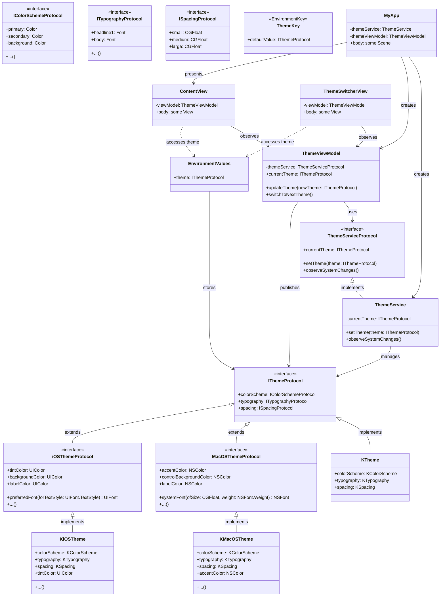

# 🎨 SwiftUI Theme Manager 🚀

Hey there, awesome developer! 👋 Welcome to the SwiftUI Theme Manager package. This cool little tool is gonna make theming your SwiftUI apps a breeze! 😎

## 🌟 Features

- 🔌 Plug and play - no setup required!
- 🔒 End-to-end type safety (because we all hate runtime crashes, right?)
- 🛠 Customizable existing themes
- 🎭 Create and use your own custom themes
- 🔄 Easy theme switching on the fly
- 👀 View all the colors in your theme
- 🎨 Set custom color schemes
- 📱 Default theme change/view UI included
- 🖌 Ability to create your own theme change/view UI
- 🍎 Follows Apple guidelines and best practices
- 📦 Available through Swift Package Manager
- 🖥️ Support for both macOS and iOS

## 🏗 Architecture

Here's a detailed look at our awesome architecture:



## 🧠 How It All Works Together

Our theme manager is built on the MVVM (Model-View-ViewModel) architecture, ensuring a clean separation of concerns. Here's how it all fits together:

1. 🏗 Model Layer:
   - Core theme protocols: `IThemeProtocol`, `IColorSchemeProtocol`, `ITypographyProtocol`, `ISpacingProtocol`
   - Platform-specific protocols: `MacOSThemeProtocol`, `iOSThemeProtocol`
   - Concrete implementations: `KTheme`, `KMacOSTheme`, `KiOSTheme`

2. 🛠 Service Layer:
   - `ThemeServiceProtocol`: Defines the contract for theme management
   - `ThemeService`: Concrete implementation that manages the current theme and observes system changes

3. 🧠 ViewModel Layer:
   - `ThemeViewModel`: Acts as a bridge between the View and Model/Service layers
   - Exposes the current theme as a published property
   - Provides methods for theme manipulation (e.g., `updateTheme`, `switchToNextTheme`)

4. 👀 View Layer:
   - `ContentView`: Main view that uses the current theme
   - `ThemeSwitcherView`: Allows users to switch between themes
   - Both views observe the `ThemeViewModel` for changes

5. 🌍 SwiftUI Environment:
   - `ThemeKey`: Custom environment key for storing the current theme
   - Extension on `EnvironmentValues`: Allows easy access to the theme throughout the view hierarchy

6. 🚀 App Entry Point:
   - `MyApp`: Sets up the `ThemeService`, `ThemeViewModel`, and injects them into the SwiftUI environment

This structure ensures:
- 🧩 Modularity: Each component has a single responsibility
- 🔄 Flexibility: Easy to extend with new themes or platform-specific implementations
- 🧪 Testability: Each layer can be tested in isolation
- 🍎 SwiftUI Best Practices: Uses environment objects and values for dependency injection and state management

## 📁 Project Structure

Here's how we've organized our project:

```
SwiftUIThemeManager/
├── Package.swift
├── README.md
├── LICENSE.md
├── Sources/
│   └── SwiftUIThemeManager/
│       ├── Core/
│       │   ├── Protocols/
│       │   │   ├── IThemeProtocol.swift
│       │   │   ├── IColorSchemeProtocol.swift
│       │   │   ├── ITypographyProtocol.swift
│       │   │   ├── ISpacingProtocol.swift
│       │   │   ├── MacOSThemeProtocol.swift
│       │   │   └── iOSThemeProtocol.swift
│       │   ├── Models/
│       │   │   ├── KTheme.swift
│       │   │   ├── KColorScheme.swift
│       │   │   ├── KTypography.swift
│       │   │   ├── KSpacing.swift
│       │   │   ├── KMacOSTheme.swift
│       │   │   └── KiOSTheme.swift
│       │   └── Enums/
│       │       ├── ColorKey.swift
│       │       ├── TypographyKey.swift
│       │       └── SpacingKey.swift
│       ├── Services/
│       │   ├── ThemeServiceProtocol.swift
│       │   └── ThemeService.swift
│       ├── ViewModels/
│       │   └── ThemeViewModel.swift
│       ├── Views/
│       │   ├── ThemePreviewView.swift
│       │   └── ThemeSwitcherView.swift
│       ├── Environment/
│       │   └── ThemeEnvironment.swift
│       └── Utils/
│           └── ThemeModifier.swift
├── Tests/
│   └── SwiftUIThemeManagerTests/
│       ├── CoreTests/
│       ├── ServiceTests/
│       ├── ViewModelTests/
│       └── ViewTests/
└── Examples/
    ├── MacOSExample/
    └── iOSExample/
```

## 📘 Usage Guide

Using our theme manager is super easy! Here's a quick guide:

1. 📦 Install the package (detailed SPM instructions coming soon!)
2. 🏗 Set up your app's entry point:

```swift
@main
struct MyApp: App {
    let themeService = ThemeService(initialTheme: KTheme())
    @StateObject private var themeViewModel: ThemeViewModel
    
    init() {
        let themeVM = ThemeViewModel(themeService: themeService)
        _themeViewModel = StateObject(wrappedValue: themeVM)
    }
    
    var body: some Scene {
        WindowGroup {
            ContentView()
                .environmentObject(themeViewModel)
                .environment(\.theme, themeViewModel.currentTheme)
        }
    }
}
```

3. 🎨 Use the theme in your views:

```swift
struct ContentView: View {
    @EnvironmentObject var themeViewModel: ThemeViewModel
    
    var body: some View {
        Text("Hello, World!")
            .foregroundColor(themeViewModel.currentTheme.colorScheme.primary)
            .font(themeViewModel.currentTheme.typography.body)
    }
}
```

4. 🔄 Change themes on the fly:

```swift
struct ThemeSwitcherView: View {
    @EnvironmentObject var themeViewModel: ThemeViewModel
    
    var body: some View {
        Button("Switch Theme") {
            themeViewModel.switchToNextTheme()
        }
    }
}
```

And that's it! You're now a theming wizard! 🧙‍♂️✨

## 🗺 Roadmap

Here's what we're planning to work on:

- [ ] Implement core theme protocols and models
- [ ] Create platform-specific theme protocols (macOS, iOS)
- [ ] Develop theme service for managing themes
- [ ] Build theme view model for MVVM architecture
- [ ] Design and implement SwiftUI views for theme preview and selection
- [ ] Create custom environment key for theme injection
- [ ] Implement theme modifier for easy theme application
- [ ] Write comprehensive unit tests for all components
- [ ] Develop sample apps for macOS and iOS
- [ ] Create detailed documentation and usage guide
- [ ] Implement CI/CD pipeline for automated testing and deployment

## 🤝 Contributing

We'd love your help to make this package even more awesome! Whether it's fixing bugs, adding features, or improving documentation, all contributions are welcome. Just fork the repo, make your changes, and submit a pull request. Let's build something great together! 💪

## 📃 License

This project is licensed under the MIT License - see the [LICENSE.md](LICENSE.md) file for details. Basically, do whatever you want with it! 😄

## 🙏 Acknowledgments

- Shoutout to the SwiftUI team for making such an awesome framework!
- Thanks to all the cool developers who'll be using and contributing to this package!

Remember, stay awesome and keep coding!
