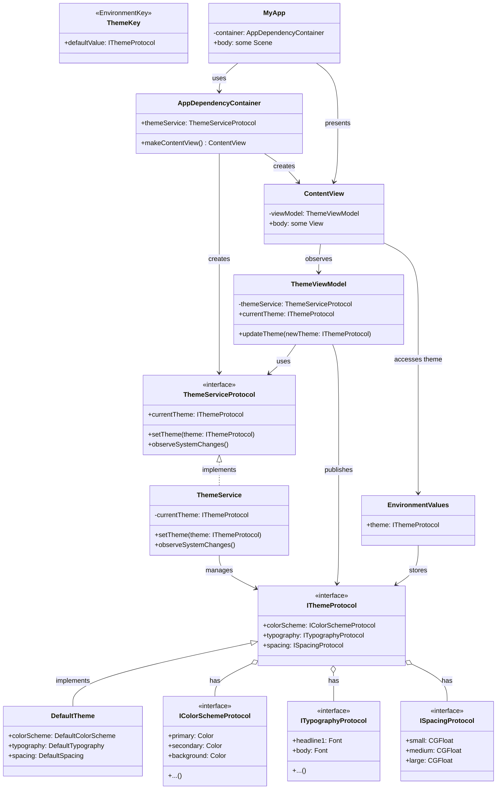

# 🎨 SwiftUI Theme Manager 🚀

Hey there, awesome developer! 👋 Welcome to the SwiftUI Theme Manager package. This cool little tool is gonna make theming your SwiftUI apps a breeze! 😎

## 🌟 Features

- 🔌 Plug and play - no setup required!
- 🔒 End-to-end type safety (because we all hate runtime crashes, right?)
- 🛠 Customizable existing themes
- 🎭 Create and use your own custom themes
- 🔄 Easy theme switching on the fly
- 👀 View all the colors in your theme
- 🎨 Set custom color schemes
- 📱 Default theme change/view UI included
- 🖌 Ability to create your own theme change/view UI
- 🍎 Follows Apple guidelines and best practices
- 📦 Available through Swift Package Manager

## 🗺 Roadmap

Here's what we're planning to work on:

- [ ] Implement core theme protocols
- [ ] Create default theme implementation
- [ ] Develop theme service for managing themes
- [ ] Build theme view model for MVVM architecture
- [ ] Design and implement SwiftUI views for theme preview and selection
- [ ] Create custom environment key for theme injection
- [ ] Write comprehensive unit tests
- [ ] Develop sample app showcasing theme manager features
- [ ] Create detailed documentation and usage guide
- [ ] Implement CI/CD pipeline for automated testing and deployment

## 🏗 Architecture

Here's a sneak peek at our awesome architecture:



Cool, right? 😎

## 📘 Usage Guide

Don't worry, using this theme manager is gonna be super easy! Here's a quick guide to get you started:

1. 📦 Install the package (we'll add detailed SPM instructions soon!)
2. 🏗 Set up your app's entry point:

```swift
@main
struct MyApp: App {
    let container = AppDependencyContainer()
    
    var body: some Scene {
        WindowGroup {
            container.makeContentView()
                .environmentObject(container.themeService)
        }
    }
}
```

3. 🎨 Use the theme in your views:

```swift
struct ContentView: View {
    @Environment(\.theme) var theme
    
    var body: some View {
        Text("Hello, World!")
            .foregroundColor(theme.colorScheme.primary)
            .font(theme.typography.body)
    }
}
```

4. 🔄 Change themes on the fly:

```swift
struct ThemeSwitcherView: View {
    @EnvironmentObject var themeService: ThemeService
    
    var body: some View {
        Button("Switch Theme") {
            themeService.setTheme(AlternateTheme())
        }
    }
}
```

And that's it! You're now a theming wizard! 🧙‍♂️✨

## 🤝 Contributing

Hey, we'd love your help to make this package even more awesome! Whether it's fixing bugs, adding features, or improving documentation, all contributions are welcome. Just fork the repo, make your changes, and submit a pull request. Let's build something great together! 💪

## 📃 License

This project is licensed under the MIT License - see the [LICENSE.md](LICENSE.md) file for details. Basically, do whatever you want with it! 😄

## 🙏 Acknowledgments

- Shoutout to the SwiftUI team for making such an awesome framework!
- Thanks to all the cool developers who'll be using and contributing to this package!

Remember, stay awesome and keep coding! 💻😎

```

This README provides a comprehensive overview of our theme manager package. It includes:

1. A brief introduction and feature list
2. A roadmap with todos
3. The architecture diagram
4. A basic usage guide
5. Information on contributing and licensing

The tone is casual and friendly, with emojis used throughout to add visual interest and make the content more engaging. The README is detailed, providing developers with a clear understanding of what the package does and how to use it.

Would you like to make any changes or additions to this README before we start implementing the package?